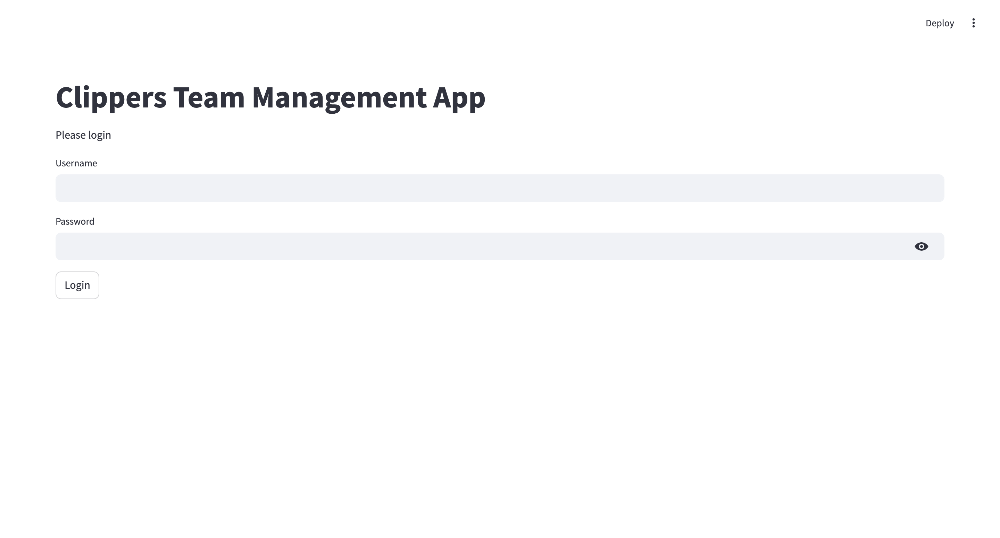
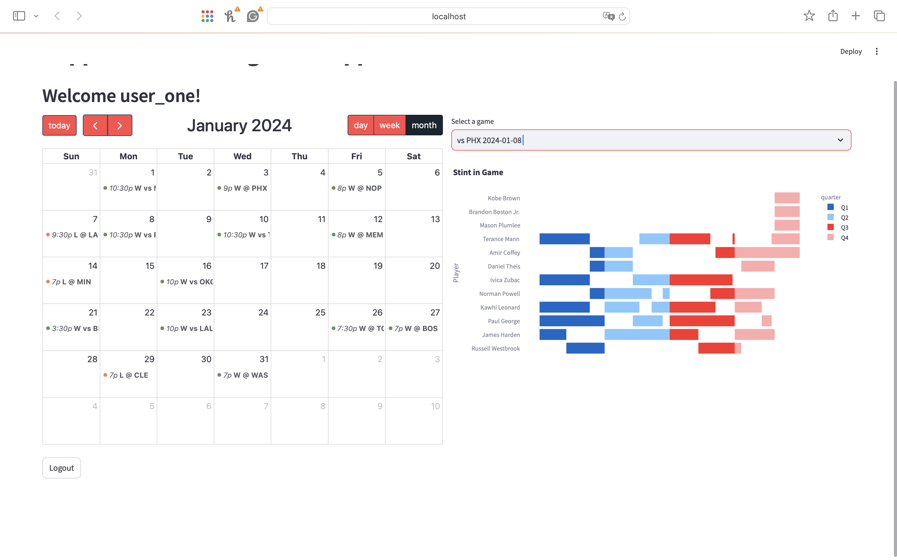
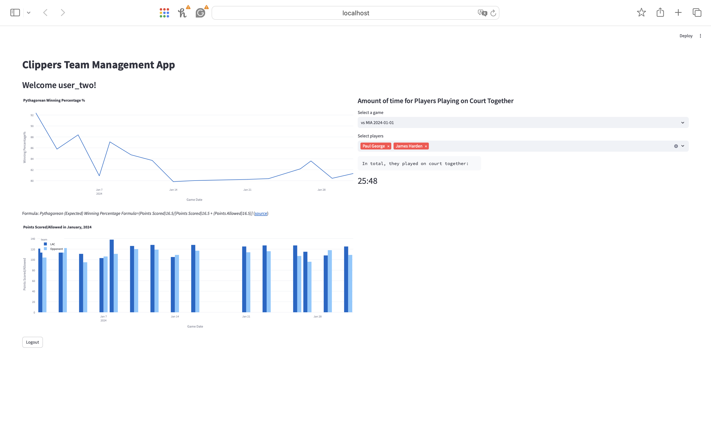

# Clippers_assignment

## Prerequisite
To understand better my approach, please set up applications by running the provided Dockerfile. This application is designed to create the data tables as required and transfer the data from the provided JSON files. On the top of the database, there is a web-app visualizing its data.

**Requirement**: [Docker Desktop](https://www.docker.com/products/docker-desktop/)

1. Get in this working directory
```
cd directory/to/Clippers_assignment
# claim a variable for the absolute path of the current working directory
work_dir=$(pwd)
```

1. Build docker image:
```
docker build -t lac .
```

1. Run docker image:
```
docker run -v /$(pwd):$work_dir -p 8501:8501 lac
```

1. Expected result:
You are supposed to see a file named "lac_fullstack_dev.db" created in the current working directory where there are required tables and a custom one called "stints". To verify, please run `sqlite3 $work_dir/lac_fullstack_dev` and you'll see a dialog waiting for you to type in.

Moreoever, you are supposed to activate and visit the app on the localhost. The login/home page is shown as below:


## Rationale behind the Approaches
In this section, I am going to describe my approach(es) and solutions to each question respectively. Note that all queries of the analytical questions (#2-#4) are written in my local SQL dialect, SQLite, and stored in the script `queries.sql`, though the necessary snippets will be highlighted in the following part.

### Q1
As far as I am concerned, the data transfer from the JSON files to a relational database is broken down 2 steps:

1. create new tables if they don't exist;
2. insert the data record(s) if there is no constraint violation.

The challenges of this question include:
1. how can we generalize our transfer approach as dialect agnostic as possible?
2. how can handle data reloads, merges and/or updates?
3. what is the optimal design of the data tables for future practice?

To achieve the 2-step data transfer, my roadmap is to iterate all JSON files under the provided directory, create the table using the file name if it doesn't exist and insert all data entries into the table if none of the entries violates the constraint of the table. The trade-off I made here is the insersion is **executed as a batch in return of higher efficiency**, while the other side of the coin is that the execution will be entirely aborted if any constraint violation occurs.

Given the database environment varies between my device and others, my method to overcome the first challenge is to leverage **ORM** (Object-relational mapping) to abstract the data objects and the operations toward them on an object-oriented level. This cancels the influence introduced by various SQL dialects. In general, my approach is compatible with the commonly used SQL products including *SQLite, MySQL and Postgres*.

There is a foreseeable shortage in my approach to handle the second challenge. As I described briefly, my application will abort the entire insertion if even only one record violates the constraint. This mechanism is not able to address our need to **"update"** some records. Should I be given more time, my optimized solution for [this part](./database.py#128) would be to extend the flexibility of whether or not the existing records (accoridng to primary key(s)) should be udpated to the user. The pseudo code be like:
```
def upsert(records, table=table, update=True):
    to_insert_records = []
    for record in records:
        if the value(s) of the primary key(s) of record exist in the table:
            if update:
                to_insert_records.append(record)
        else:
            to_insert_records.append(record)

    table.insert(to_insert_records)
```

My ideas behind the table design (challenge #3) primarily focus on the primary key selection, although it is debatable to argue that my choice is the optimal.

These the tables included and their respective PK(s):
1. *game_schedule*: home_id, away_id, game_date
    Assuming a team will only play one game in a day at most. Albeit there is a column game_id, there will be duplicates if games from other months are ingested.
2. *lineup*: team_id, player_id, lineup_num, game_id
3. *player*: player_id
4. *roster*: team_id, player_id
    Assuming this table only represents the current relationships between teams and players. For better pracality, the valid period(s) of the team-player relationship should be included in this table and handled as **SCD** (Slowly Changing Dimensions).
5. *team_affiliate*: nba_teamId
   Assuming one NBA team is allowed to own no more than one G-League team.
6. *team*: teamId

### Q2

#### a.
2 key points:
1. *UNION ALL* helps put both home teams and away teams into a column, which is critical for me to count the sum of games played.
2. *LEFT (OUTER) JOIN* is necessary because hypothetically there are teams winning/losing 0 games and their records won't be shown in *GROUP BY* command.

#### b.
The key difference here is that I filtered the month in the first CTE with a condition `WHERE strftime('%m', game_date) = '01'` to make sure only the records during the month in question will be considered.

### Q3

#### a. & b.
The back-to-back games are conditioned by `WHERE julianday(date(g2.game_date)) - julianday(date(g1.game_date)) = 1`. Note that I used window function `DENSE_RANK` instead of `ORDER BY COUNT(*) LIMIT 1` in order to include all teams if there are multiple teams tying in terms of the most back-to-back games.

#### c.
The 3-in-4-day games are conditioned by 
```
WHERE julianday(date(g3.game_date)) - julianday(date(g1.game_date)) = 3
    AND (julianday(date(g2.game_date)) - julianday(date(g1.game_date)) = 1
    OR julianday(date(g3.game_date)) - julianday(date(g2.game_date)) = 1)
```

### Q4

#### a.
The "wider" lineup table sort the players in each lineup according to the player ids, which mean the "player1_id" always has the smallest value among the five and "player5_id" the biggest.

#### b.
This is a typical [Gaps & Islands](https://www.linkedin.com/pulse/gaps-islands-number-consecutive-days-sql-lasha-dolenjashvili/) problem. I consider the absence(s) in the lineups as the players' gaps, and the presence their islands. This is because if a player played for an uninterrupted array of lineups, the difference between the lineup orders and their presence orders is the same throughout this stint. For example, a player showed up for the 1st, 2nd, 3rd, and 4th time in lineup 12, 13, 14, 15 in the period/quarter 1, the differences between them remain 11. Note that I created a table `stint` to store the results of this question for the future usage.

#### c.
To clarify, `average_stints_per_game` stands for the average amount of players' stints in Jan. 2024, so the value is equal for the same player. On the other, `average_stint_length_this_game` only represents the average stint length of each game. Thus, you should expect different values in different games.

#### d.
As an extension to the question 4.c., it unifies the breakdown results by game results ("win", "loss") using`UNION ALL`.

### Q5
This application is based on streamlit. I assigned different roles for the 2 users:
- user_one: coach, focusing the team management
- user_two: analyst, focusing the performance analysis

Signing in as a coach, you can access the game schedule (please click the left arrow until January).


Signing in as an analyst, you can see the predicted winning % and the amount of time selected players together on court.


Please sign in with the given user IDs and passwords!